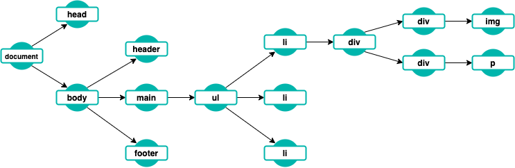
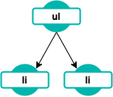

# [Curso de JavaScript avanzado para desarrolladores](https://fictizia.com/formacion/curso-javascript-avanzado)

## Clase 15

- HTML5 APIs
  - BOM y DOM
  - Drag & Drop
  - Intersection Observer
  - Persistencia:
    - Cookies
    - WebStorage:
      - LocalStorage
      - SessionStorage

## APIS de Navegador

El navegador nos proporciona una serie de APIs que podemos utilizar para mejorar la experiencia de usuario de las páginas web que desarrollamos. Estas APIs son muchas y muy diversas, desde APIs de manejo de ficheros hasta síntesis de voz.

### BOM y DOM

Existen dos conceptos muy importantes a la hora de tratar con el navegador, BOM y DOM. Ambos conceptos representan un árbol de nodos.

#### BOM

BOM (Browser Object Model) representa la ventana del navegador y contiene los componentes que son puramente ligados a esta. Desde JS podemos acceder a él a través de `window`. Estos componentes son: `history`, `location`, `navigator`, `screen` y `document`.

#### History

Representa el historial de navegación de la pestaña actual y nos permite, de forma programática, interactuar con él. Este historial, se comporta como una lista por la que podemos movernos.

```javascript
// Devuelve el número de entradas en el historial
console.log(history.length)

// Admite números enteros y nos mueve en el historial tantas posiciones cómo le indiquemos
history.go()

// Nos lleva atrás en el historial
history.back() // Equivalente a history.go(-1)

// Nos lleva adelante en el historial
history.forward() // Equivalente a history.go(1)
```

Además, podemos manipular el historial de navegación a voluntad. Hay que tener en cuenta que estos cambios han de ser sobre el mismo dominio.

* `.pushState(data, titulo, url)`: Modifica el historial de navegación añadiendo una nueva entrada y modifica el la dirección anterior sin llegar a solicitar ningún recurso. Se combina su uso con el evento `onpopstate` para la gestión del contenido dinámico. En caso de que data contenga información, esta estará disponible en `history.state`.

* `.replaceState(data, titulo, url)`: Similar a `pushState`, sólo que este reemplaza la posición actual del historial.

* Evento `onpopstate`: Este evento pertenece al objeto window. Salta cuando se ejecuta `pushState` o `replaceState` de forma programática y contiene el estado con el que se haya llamado a los métodos.

#### Navigator

Representa el navegador (User-Agent) con el que el usuario está interactuando.Contiene información que podemos consultar y algunas APIs interesantes que podemos usar. Todo lo que tenga que ver con información del dispositivo (geolocalización, bluetoth, usbs,...) se utiliza con `navigator`.

```javascript
  const informacionSistema = () => {
    console.log("appCodeName:", window.navigator.appCodeName);
    console.log("appName:", window.navigator.appName);
    console.log("appVersion:", window.navigator.appVersion);
    console.log("platform:", window.navigator.platform);
    console.log("product:", window.navigator.product);
    console.log("userAgent:", window.navigator.userAgent);
    console.log("javaEnabled:", window.navigator.javaEnabled());
    console.log("language (used):", window.navigator.language);
    console.log("language (support):", window.navigator.languages);
    console.log("conectado a internet?", window.navigator.onLine);
    console.log("mimeTypes:",window.navigator.mimeTypes);
    console.log("Plugins:", navigator.plugins);
  }
```

#### Location

Representa la localización del documento web. Sirve para interactuar con la URL del navegador.

```javascript

const dameInformacionDeLocation = () => {
  console.log(location.hash)
  console.log(location.host)
  console.log(location.hostname)
  console.log(location.href)
  console.log(location.origin)
  console.log(location.pathname)
  console.log(location.port)
  console.log(location.protocol)
}
```

**Métodos**

- `.assign(url)`: Carga la url que le indiquemos.

- `.reload(sinCache)`: Recarga la página actual. `sinCache` por defecto vale false.

- `.replace(url)`: Carga una nueva página reemplazando la anterior en el historial.

#### Screen

Representa la pantalla del dispositivo. El objeto `screen` nos provee de información relativa a la pantalla donde se está renderizando el contenido.

```javascript

  const informacionPantalla = () => {
    console.log("availTop:", window.screen.availTop);
    console.log("availLeft:", window.screen.availLeft);
    console.log("availHeight:", window.screen.availHeight);
    console.log("availWidth:", window.screen.availWidth);
    console.log("colorDepth:", window.screen.colorDepth);
    console.log("height:", window.screen.height);
    console.log("left:", window.screen.left);
    console.log("orientation:", window.screen.orientation);
    console.log("pixelDepth:", window.screen.pixelDepth);
    console.log("top:", window.screen.top);
    console.log("width:", window.screen.width);
  }
```


#### Document

DOM (Document Object Model) representa al documento HTML con el que estamos tratando. Accedemos a él usando `document` o `window.document`. Esta representación se hace en forma de árbol de nodos. Cada nodo puede tener o no hijos y, salvo el nodo raíz, tendrá un padre. Al ser una representación del HTML, el nodo raíz siempre será `document`, que tiene un nodo hijo `html` que, a su vez, tiene dos nodos hijos, `head` y `body`.

A continuación, se muestra un código html junto con su representación como árbol de nodos

```html
<html>
<head>
</head>
<body>
<header>Soy el header</header>
<main>
  <ul id="pokemonCardList" class="list"></ul>
    <li class="list-item">
      <div class="card">
        <div class="card-header">
          
        </div>
        <div class="card-title" >
          <p class="card-name">#1 Bulbasaur</p>
        </div>
      </div>
    </li>
    <li class="list-item"></li>
    <li class="list-item"></li>
  </ul>
</main>
<footer>Soy el footer</footer>
</body>
</html>
```



##### Navegando en el DOM

Cada elemento del DOM tiene una serie de propiedades que permite acceder a los nodos con los que tiene relación directa (padres, hijos y hermanos).



- `.parentNode` o `parentElement`: Guardan una referencia al elemento padre. En el ejemplo, `parentNode` de `li` es `ul`.
- `.childNodes`: Devuelve un iterable `NodeList`con los hijos. `childNodes` de `ul` serían los elementos `li`
- `.children`: Devuelve un iterable `HTMLCollection` con los hijos. `children` de `ul` serían los elementos `li`
- `.firstElementChild` o `firstChild`: Devuelve el primer hijo. `firstElementChild` de `ul` devolverá el primer `li`
- `.lastElementChild` o `lastChild`: Devuelve el último hijo. `lastElementChild` de `ul` devolverá el último `li`
- `.nextSibling` o `.nextElementSibling`: Devuelve el hermano del elemento actual. `nextSibling` del primer `li` devolverá el último `li`
- `.previousSibling` o `.previousElementSibling`: Devuelve el anterior hermano del elemento actual. `previousSibling` del último `li` devolverá el primer `li`

##### Búsqueda de elementos

Tenemos distintas formas de buscar elementos dentro del DOM:

- `.getElementById(id)`: Nos permite acceder a un elemento HTML por su atributo `id`.
- `.getElementsByName(name)`: Permite acceder a un listado de elementos a partir de su atributo `name`.
- `.getElementsByTagName(tag)`: Permite recuperar un listado de elementos a partir de su nombre de etiqueta.
- `.getElementsByClassName(clase)`: Permite recuperar un listado de elementos a partir de una clase.
- `.querySelector(consulta)`: Consulta en el DOM usando la misma sintaxis que usamos para declarar estilos. Obtiene el primer elemento que cumpla con la consulta.
- `.querySelectorAll(consultas)`: Consulta en el DOM usando la misma sintaxis que usamos para declarar estilos. Devuelve un iterable `NodeList` con las coincidencias.

##### Trabajando con clases

Todos los elementos del DOM tienen una propiedad `classList` con la que podemos interactuar con las clases que contiene. Esta propiedad contiene una serie de métodos que nos permiten interactuar con las clases de los elementos.

- `.add(clase1, clase2,... clasen)`: Añade las clases indicadas.
- `.remove(clase1, clase2,... clasen)`: Borra la clase o clases indicadas.
- `.item(indice)`: Devuelve la clase que ocupe el índice proporcionado en el listado.
- `.toggle(clase)`: Si no existe la clase la añade y devuelve true. Si existe la elimina y devuelve false.
- `.contains(clase)`: Comprueba si el elemento contiene la clase proporcionada.
- `.replace(vieja, nueva)`: Reemplaza una clase por otra.

Usaremos esta propiedad cuando queramos que un elemento tenga/deje de tener una clase concreta.

##### Modificando el árbol

- `.createElement(tag, options)`: Sirve para crear nuevos elementos HTML. Estos elementos no pertenecen al DOM.
- `.createTextNode(texto)`: Crea un elemento de texto (lo que iría dentro de cualquier elemento DOM).

- `.append(elemento1, elemento2, ...elementon)`: Permite insertar un elemento al final del listado de hijos de otro elemento padre. Admite `DomString` y otros elementos HTML.
- `.prepend(elemento1, elemento2, ...elementon)`: Permite insertar un elemento al principio del listado de hijos de otro elemento padre. Admite `DomString` y otros elementos HTML.
- `.appendChild(elemento)`: Sirve para insertar un DOM element al final del elemento. Sólo admite elementos HTML.
- `.insertBefore(elemento, referencia)`: Nos permite insertar antes de un elemento (referencia) un elemento HTML (elemento).

```javascript
const p = document.createElement('p')
const text = document.createTextNode('Qué pasa')
p.appendChild(text)

document.body.insertBefore(p, document.body.firstChild)
```

- `.removeChild(el)`: Esto nos permite eliminar un elemento.

### Modificando los elementos HTML

- `.getAttribute(atributo)`: Obtiene el valor de un atributo HTML.
- `.setAttribute(atributo, valor)`: Modifica el valor de un atributo HTML.
- `.removeAttribute(atributo)`: Borra el atributo del elemento DOM.
- `.dataset`: Permite el acceso a la información almacenada en los atributos `data-` de un elemento.xw
- `.textContent`: Contiene el texto del elemento. Reemplazando este atributo se modifica el texto del elemento.
- `.innerHTML`: Sirve para acceder al contenido HTML que hay dentro de un elemento. Reemplazándolo se modifica el HTML del elemento.
- `.outerHTML`: Sirve para acceder y modificar el HTML del propio elemento.

#### Ejemplos

* Crear elementos: Cuando queramos añadir nuevos nodos al DOM, tendremos que preguntarnos antes: ¿queremos añadir contenido estático o queremos que el usuario interactúe con él? Dependiendo de la respuesta a dicha pregunta, lo haremos de una manera u otra.

  * Contenido sin interacción: Dependiendo de cómo de complejo sea el contenido que queremos insertar usaremos una forma u otra

```javascript
// Siempre, siempre que queramos insertar algo en el DOM, tendremos que tener un elemento "padre" al que añadírselo. Para obtener este elemento usaremos cualqueira de los métodos de búsqueda que hemos visto anteriormente
const parentElement = document.querySelector('#miSelector') // también document.getElementById('miSelector')

// Para no duplicar código, vamos a dejar aquí declarado el código que vamos a insertar en los ejemplos
const elementoAInsertar = `<div class="card grass poison">
                              <div class="card-header">
                                  
                              </div>
                              <div class="card-title">
                                  <p class="card-name">#${pokemon.id} ${pokemon.name}</p>
                              </div>
                           </div>
                           <ul class="stats">
                            <li>Salud: ${pokemon.base.HP}</li>
                            <li>Ataque: ${pokemon.base.Attack}</li>
                            <li>Defensa: ${pokemon.base.Defense}</li>
                            <li> Ataque Especial: ${pokemon.base['Sp. Attack']} </li>
                            <li> Defensa Especial: ${pokemon.base['Sp. Defense']} </li>
                            <li>Velocidad: ${pokemon.base.Speed}</li>
                           </ul>`

// Una vez que tenemos este elemento nos pararemos a pensar si estamos en alguno de los siguientes casos:

// Podemos cargarnos los hijos que ya tenía el elemento padre
parentElement.innerHTML = elementoAInsertar

// Tenemos que añadir el nuevo "subarbol" como último hijo respetando los hijos que ya tiene
parentElement.append(elementoAInsertar)

// Tenemos que añadir un nuevo "subarbol" como primer hijo respetando los hijos que ya tiene
parentElement.prepend(elementoAInsertar)


// Tenemos que añadirlo entre dos de los hijos por el medio
// Este es un caso un poco especial, aquí, una vez que tengamos la referencia al elemento padre, tendremos que buscar hacerlo en base a los hijos actuales del padre

// Primero accederemos al hermano anterior a la posición que queremos obtener.
// En nuestro caso queremos insertar un elemento en la posición 3 de una lista
// así que accedemos al segundo hijo
const segundoHijo = parentElement.children[1]

// Una vez que tengamos el hermano anterior, usaremos insertBefore y nextSibling para insertar el elemento que nos interesa
parentElement.insertBefore(elementoAInsertar, segundoHijo.nextSibling)
```


## Drag and Drop

Esta API permite al usuario arrastrar elementos HTML por la pantalla de su dispositivo usando su ratón y soltarlos en otro elemento. Su uso implica la combinación de DOM y gestión de eventos de navegador.

#### Uso

Lo primero que tendremos que hacer es marcar el elemento que queremos arrastrar como `draggable`.

```html
<li class="card-item" draggable="true">
  
  <div class="card-content">
      <p class="card-title">Nombre</p>
      <p class="card-text">Nombre real</p>
      <p class="card-text">Genero</p>
  </div>
</li>
```

Una vez que ya hemos indicado que un elemento es "arrastrable", tenemos que capturar los eventos que este elemento comenzará a lanzar:

- `dragstart`: Tiene lugar cuando el elemento comienza a ser arrastrado. Capturando este evento podremos personalizar el comportamiento del drag.
- `drag`: Salta mientras el elemento es arrastrado.
- `dragend`: La operación de arrastrar acaba, ya sea porque se suelta el ratón o porque se pulsa escape.
- `dragenter`: El elemento arrastrado entra en una zona en la que se maneja el drop.
- `dragleave`: El elemento deja la zona de drop.
- `dragover`: Salta mientras el elemento se arrastre sobre una zona de drop.
- `drop`: El elemento se suelta sobre una zona de drop valida. Este evento se debe escuchar desde el elemento donde se va a soltar. Por defecto, el navegador evita el comportamiento de cualquier elemento para este evento, por lo que para poder escucharlo siempre tendremos que ejecutar `preventDefault()`

Una vez que comenzamos a arrastrar, podemos interactuar con la interfaz `dataTransfer` contenida en el evento que toque para disponer de la información que necesitemos.

Para interactuar con esta información usaremos los siguientes métodos:

- `.setData(mime, dato)`: Almacena información basada en su MIME.

```javascript
  const onDragStart = function(event) {
      console.log('dragStart', event)
      removeZone.classList.add('dragging')
      event.dataTransfer.setData('text/plain', this.id);
      event.dataTransfer.setData('text/uri-list', 'https://www.fictizia.com/')
      event.dataTransfer.setData("text/html", this.outerHTML);
  }
```

- `.getData(dato)`: Recupera la información almacenada en eventTransfer.

```javascript
  const onDrop = function (event) {
    const text = event.dataTransfer.getData('text')
    const link = event.dataTransfer.getData('URL')
  }
```

### Intersection Observer

La API Intersection Observer nos permite observar se produce una intersección entre dos elementos o un elemento y el viewport.

#### Uso

Lo primero que haremos para utilizar esta API será crear una nueva instancia de `IntersectionObserver` usando el constructor de su clase.

```javascript

const observer = new IntersectionObserver(callback, options);
```

Este constructor recibirá dos parámetros:

- El callback que se ejecutará cuando los elementos se crucen.
- La configuración para que este callback se ejecute. Esta configuración tiene tres opciones:
  - `root`: Indica el elemento con el que queremos que se cruce. Por defecto vale `null`, haciendo referencia al viewport del navegador.
  - `rootMargin`: El margin con respecto a ese elemento expresado como si fuera css.
  - `threshold`: Sirve para indicar los porcentajes de cruce en los que se debe ejecutar la función de callback. Estos son valores comprendidos entre 0 y 1. Puede ser un único valor numérico o un array. El valor por defecto será 0.


```javascript

const options = {
  root: null,
  rootMargin: "0px",
  threshold: 0
}
```

Cuando el callback se invoca, recibe dos parámetros. El primero es una lista y el segundo es el propio observer.

```javascript
const callback = (entries, observer) => {
  entries.forEach(entrada => {
    console.log(entry.intersectionRatio) // Devuelve el porcentaje de interseción
    console.log(entry.isIntersecting) // Devuelve true o false si los elementos se están cruzando o no
    console.log(entry.target)
  })
}
```

El observador que creemos tendrá los siguientes métodos:

- `.observe(elemento)`: Recibe un elemento HTML que queremos que observe con la configuración suministrada.

- `.unobserve(elemento)`: Le dice al IntersectionObserver que deje de observar al elemento que recibe.

- `.takeRecords()`: Devuelve un array con todas las intersecciones que se han producido.

- `.disconnect()`: Nuestro IntersectionObserver dejará de observar los elementos.


Una vez que sepamos que elemento queremos observar, obtendremos una referencia al mismo y comenzaremos a observarlo.

```javascript

const miElemento = documen.getElementById('teVeo');

observer.observe(miElemento)
```

## Persistencia

Uno de las muchas cosas que podemos conseguir gracias a las APIs de navegador es persistir datos y contenido de forma que podamos acceder a ellos en diferentes cargas de un sitio web. Existen distintas funcionalidades que nos permiten conseguir este comportamiento, desde las tradicionales Cookies, hasta un BBDD integrada en el navegador. A continuación cuales son y cómo se diferencian.

### Cookies

Se tratan del mecanismo más tradicional para almacenar datos de sesión. Estas almacenan un par clave-valor en formato texto. Tradicionalmente, son enviadas por el servidor a través de la cabecera `Set-Cookie` indicando el nombre de la Cookie y el contenido así como su configuración: tiempo de expiración (`expires`), dominio (`domain`), si sólo funciona por https (`secure`) y si se debe ocultar al código JS (`httponly`). Además, se pueden crear desde JS, pero no es una práctica muy recomendable ya que estas serán siempre inseguras. Es uno de los mecanismos más extendidos cuando se trata de persistir datos sensibles de sesión. Presentan las siguientes limiteaciones:

- Espacio limitado: sólo 4KB por cookie. Algunos navegadores, además, limitan el tamaño por dominio. Cada navegador soporta un número máximo de cookies por dominio diferente. La practica más recomendable es no tener más de 30 cookies por dominio y que no ocupen en total más de 4KB.
- Las cookies viajarán en todas las peticiones dentro del mismo dominio sin importar el tipo de recurso que se solicite en la cabecera `Cookie` hasta que caduquen.

#### Trabajando con cookies

Podemos acceder a las cookies "inseguras" del navegador así cómo a las que están dentro de nuestro dominio usando la API que nos proporciona el navegador. Para ello, interactuaremos con la propiedad `cookie` de `document`.

```javascript
// Esto devuelve todas las cookies como string junto con su configuración
const cookies = document.cookie

// Si quisieramos crear nuestra propia cookie, modificaríamos esta propiedad.
// Aunque modifiquemos varias veces la propiedad, lo que ocurre por debajo es que
// se añaden al string que contiene todas las cookies
// Si volvemos cambiar el valor de una cookie, la reemplazaremos.
document.cookie = 'username=Aquaman'

// También podemos configurar el dominio y el tiempo de expiración con este método
const tomorrow = new Date()
tomorrow.setDate(tomorrow.getDate() + 1)
document.cookie = `username=Aquaman; expires=${tomorrow.toUTCString()}; path=/profesorado`

// Para borrar una cookie programaticamente, lo que tenemos que hacer es modificar
// la fecha de expiración a una pasada

const yesterday = new Date()
yesterday.setDate(tomorrow.getDate() - 1)
document.cookie = `username=Aquaman; expires=${yesterday.toUTCString()}; path=/profesorado`
```

### WebStorage

Con HTML5 llegaron funcionalidades muy interesantes a los navegadores. Una de ellas fue la api WebStorage que permite almacenar en el navegador información en formato texto de forma totalmente independiente del servidor. Esta API es totalmente síncrona y la información que guarda va asociada a un dominio.

Esta API proporciona dos interfaces `sessionStorage` y `localStorage` para interactuar con el objeto `Storage`. Ambas tienen los mismos métodos y propiedades y soportan hasta 10MB, lo única diferencia es la durabilidad de los datos. `localStorage` mantendrá los datos sin límites de expiración, mientras que `sessionStorage` sólo los matendrá mientras esté abierta la pestaña del navegador.

#### Métodos

- `.getItem(clave)`: Obtiene la información guardada para una clave dada. Dicha información siempre será devuelta en formato texto.

- `.setItem(clave, valor)`: Modifica el valor para una clave dada.

- `.removeItem(clave)`: Borra un valor a partir de su clave.

```javascript
for(let i = 0; i < 10; i++) {
  localStorage.setItem(i, `clave ${i}`)
}

console.log(localStorage.getItem('4'))

localStorage.removeItem('4')

console.log(localStorage.getItem('4'))
```

- `.clear()`: Elimina toda la información guardada.

```javascript
for(let i = 0; i < 10; i++) {
  localStorage.setItem(i, `clave ${i}`)
}

console.log(localStorage.getItem('4'))

localStorage.clear()

for(let i = 0; i < 10; i++) {
  console.log(localStorage.getItem(`${i}`))
}
```
